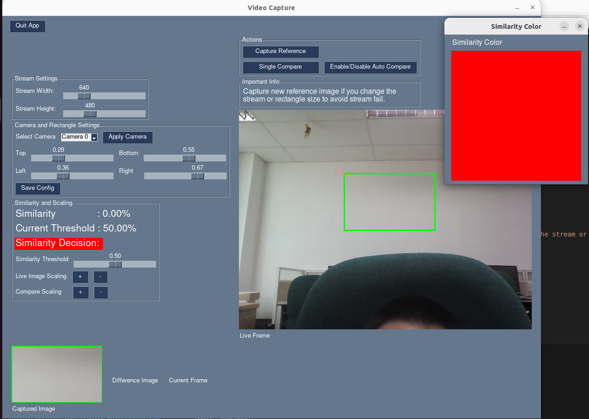
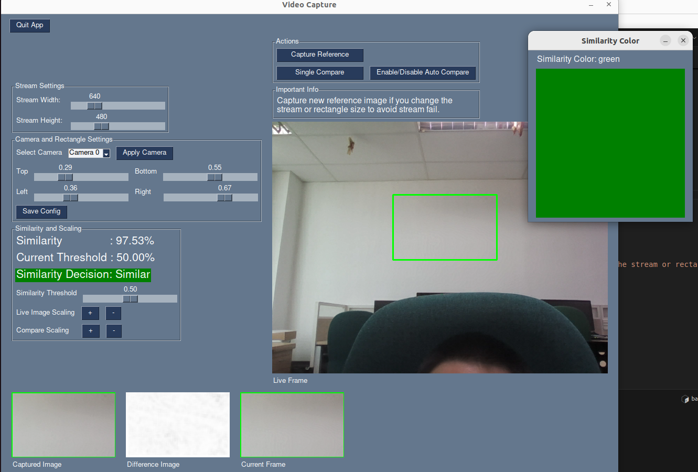

# Image Compare App

## Usage

Run the app with `python3 app.py`

This app is used to compare two images using the SSIM algorithm. 

Image of App Usage

Image of App start running

## Development

1. Create a virtual environment with `python3 -m venv venv`
2. Activate the virtual environment with `source venv/bin/activate`
3. Install the required packages with `pip install -r requirements.lock.txt`
4. Run the app with `python3 app.py`

## Important Information

If you change the stream dimensions or the rectangle size, you must capture a new reference image. Failing to do so will result in the stream comparison failing. This is because the reference image must match the current stream dimensions and rectangle size for accurate comparison.

To capture a new reference image:
1. Adjust the stream dimensions or rectangle size as needed.
2. Click the "Capture Reference" button to capture a new reference image.
3. Proceed with the comparison as usual.

Remember to always capture a new reference image after making any changes to the stream or rectangle size.
